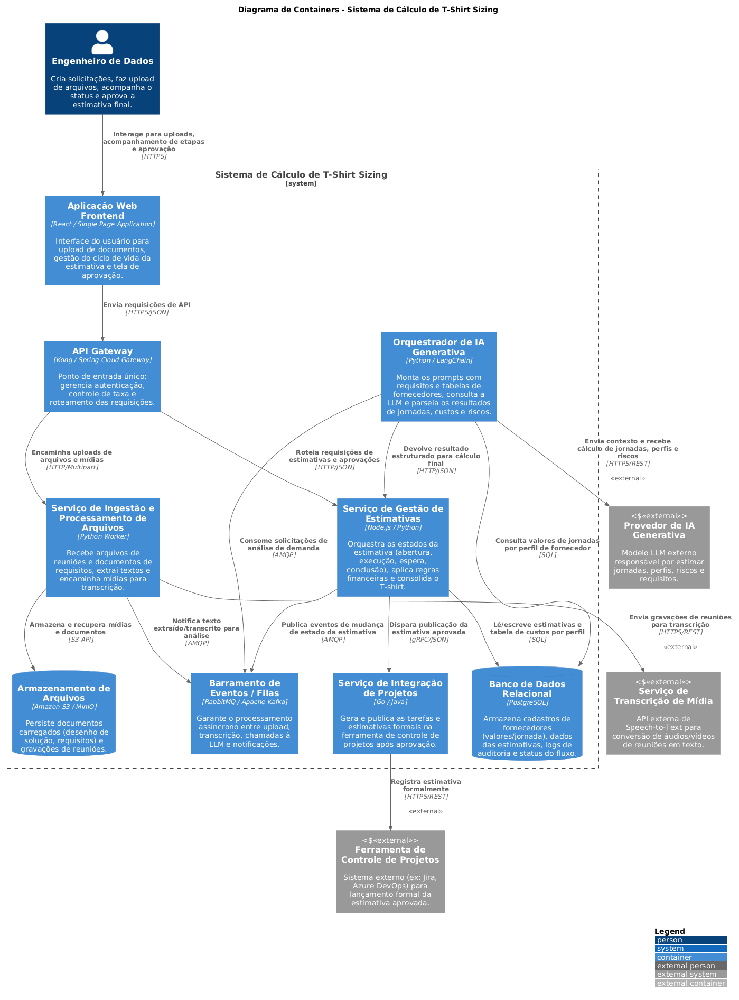

# Resposta-prompt-1

Aqui está a resposta reestruturada estritamente a partir das instruções do arquivo fornecido.

### **1. Lacunas e Perguntas**

**Lacunas identificadas (8 lacunas):**
1. **Processamento e transcrição de mídias:** O prompt cita upload de gravações de áudio/vídeo, mas não explicita se o sistema realiza a transcrição internamente via serviço de Speech-to-Text ou se espera apenas arquivos de texto/transcrições prontas.
2. **Armazenamento de arquivos pesados:** Não é definido onde os arquivos de mídia (vídeo/áudio) e documentos (desenho de solução, requisitos) serão armazenados nem a retenção dessas mídias.
3. **Gestão dos contratos de fornecedores:** Falta detalhar se haverá um cadastro interno de taxas por perfil/jornada ou se os contratos serão enviados como arquivo em cada estimativa.
4. **Alçada de aprovação:** Não fica claro se a aprovação é feita por um único usuário ou se exige um fluxo de aprovação com múltiplos papéis (ex.: Lead de Dados + Gestor Financeiro) antes do envio à ferramenta de projetos.
5. **Comunicação assíncrona e tempo de resposta da LLM:** Chamadas a LLMs e processamento de arquivos pesados podem demorar; não há definição de mecanismo de mensageria ou retentativas (*retry/circuit breaker*).
6. **Identificação da ferramenta de gestão de projetos:** A ferramenta externa (ex.: Jira, Azure DevOps, ServiceNow) não é especificada, impedindo a definição exata do conector.
7. **Privacidade e segurança de dados (LGPD / IP):** Envio de transcrições e contratos a modelos de IA Generativa pode expor dados sensíveis se a LLM for pública.
8. **Mecanismo de acompanhamento de estado:** O prompt pede o fluxo de etapas (abertura, execução, espera, conclusão), mas não especifica como o usuário acompanha o estado em tempo real (ex.: WebSockets vs. Polling).

**Perguntas de esclarecimento (6 perguntas):**
1. O sistema deve fazer a transcrição de áudios/vídeos via serviço externo (ex.: Whisper API) ou receberá apenas arquivos já transcritos?
2. Qual é a ferramenta de controle de projetos de destino para onde a estimativa aprovada será enviada (ex.: Jira, Azure DevOps)?
3. A LLM utilizada será um modelo comercial público (ex.: OpenAI API) ou um modelo hospedado em infraestrutura privada (on-premise/cloud dedicada)?
4. As tabelas de valores de jornadas por perfil de fornecedor ficam armazenadas previamente em banco de dados ou são enviadas via upload em cada solicitação?
5. O processo de aprovação da estimativa requer interface própria no sistema ou notificações em ferramentas de colaboração (ex.: Teams/Slack)?
6. Há necessidade de persistir o histórico completo de versões de uma mesma estimativa caso o usuário solicite reprocessamento da LLM?

### **2. Roteiro Revisado**

**Descrição Técnica do Sistema:** O **Sistema para Cálculo de T-Shirt** é uma solução voltada ao time de engenharia de dados para estimar esforço, custo e premissas técnicas na construção de fluxos de dados.
- **Escopo:** Upload de documentos e mídias, processamento do contexto via LLM, cálculo de custos com base na jornada por perfil, gestão do ciclo de vida da estimativa (abertura, execução, espera e conclusão) e integração final com ferramenta de projetos após aprovação humana.
- **Nível (C4):** Containers.
- **Limites e Responsabilidades:** O sistema orquestra as etapas de estimativa, persiste dados de apoio e integra com serviços terceiros. Não é responsável pela execução ou deploy dos pipelines de dados em si.
- **Integrações Externas:** Serviço de IA Generativa (LLM), Serviço de Transcrição de Mídia (Speech-to-Text) e Ferramenta de Controle de Projetos.
- **Restrições:** Diagrama estrutural sem exposição de URIs/endpoints; sistemas externos identificados rigorosamente com o estereótipo <<external>>.
- **Lacunas Assumidas:** O processamento de arquivos é assíncrono via mensageria; a transcrição de mídias é delegada a um serviço externo especializado; a LLM recebe prompts anonimizados com os dados dos contratos mantidos em banco interno.

### **3. Código PlantUML (Nível de Containers C4)**

```plantuml
@startuml
!include https://raw.githubusercontent.com/plantuml-stdlib/C4-PlantUML/master/C4_Container.puml
LAYOUT_WITH_LEGEND()
title Diagrama de Containers - Sistema de Cálculo de T-Shirt Sizing
Person(engenheiro, "Engenheiro de Dados", "Cria solicitações, faz upload de arquivos, acompanha o status e aprova a estimativa final.")
System_Boundary(tshirt_system, "Sistema de Cálculo de T-Shirt Sizing") {
    Container(web_app, "Aplicação Web Frontend", "React / Single Page Application", "Interface do usuário para upload de documentos, gestão do ciclo de vida da estimativa e tela de aprovação.")
    Container(api_gateway, "API Gateway", "Kong / Spring Cloud Gateway", "Ponto de entrada único; gerencia autenticação, controle de taxa e roteamento das requisições.")
    Container(estimativa_service, "Serviço de Gestão de Estimativas", "Node.js / Python", "Orquestra os estados da estimativa (abertura, execução, espera, conclusão), aplica regras financeiras e consolida o T-shirt.")
    Container(ingestao_service, "Serviço de Ingestão e Processamento de Arquivos", "Python Worker", "Recebe arquivos de reuniões e documentos de requisitos, extrai textos e encaminha mídias para transcrição.")
    Container(ia_orchestrator, "Orquestrador de IA Generativa", "Python / LangChain", "Monta os prompts com requisitos e tabelas de fornecedores, consulta a LLM e parseia os resultados de jornadas, custos e riscos.")
    Container(integracao_projetos_service, "Serviço de Integração de Projetos", "Go / Java", "Gera e publica as tarefas e estimativas formais na ferramenta de controle de projetos após aprovação.")
    ContainerDb(database, "Banco de Dados Relacional", "PostgreSQL", "Armazena cadastros de fornecedores (valores/jornada), dados das estimativas, logs de auditoria e status do fluxo.")
    ContainerDb(file_store, "Armazenamento de Arquivos", "Amazon S3 / MinIO", "Persiste documentos carregados (desenho de solução, requisitos) e gravações de reuniões.")
    Container(message_broker, "Barramento de Eventos / Filas", "RabbitMQ / Apache Kafka", "Garante o processamento assíncrono entre upload, transcrição, chamadas à LLM e notificações.")
}
System_Ext(ext_llm, "Provedor de IA Generativa", "Modelo LLM externo responsável por estimar jornadas, perfis, riscos e requisitos.", "<<external>>")
System_Ext(ext_transcriber, "Serviço de Transcrição de Mídia", "API externa de Speech-to-Text para conversão de áudios/vídeos de reuniões em texto.", "<<external>>")
System_Ext(ext_project_tool, "Ferramenta de Controle de Projetos", "Sistema externo (ex: Jira, Azure DevOps) para lançamento formal da estimativa aprovada.", "<<external>>")
' Relacionamentos Usuário -> Sistema
Rel(engenheiro, web_app, "Interage para uploads, acompanhamento de etapas e aprovação", "HTTPS")
Rel(web_app, api_gateway, "Envia requisições de API", "HTTPS/JSON")
' Roteamento do Gateway
Rel(api_gateway, estimativa_service, "Roteia requisições de estimativas e aprovações", "HTTP/JSON")
Rel(api_gateway, ingestao_service, "Encaminha uploads de arquivos e mídias", "HTTP/Multipart")
' Relacionamentos Internos - Serviço de Estimativas
Rel(estimativa_service, database, "Lê/escreve estimativas e tabela de custos por perfil", "SQL")
Rel(estimativa_service, message_broker, "Publica eventos de mudança de estado da estimativa", "AMQP")
Rel(estimativa_service, integracao_projetos_service, "Dispara publicação da estimativa aprovada", "gRPC/JSON")
' Relacionamentos Internos - Ingestão e Mídia
Rel(ingestao_service, file_store, "Armazena e recupera mídias e documentos", "S3 API")
Rel(ingestao_service, ext_transcriber, "Envia gravações de reuniões para transcrição", "HTTPS/REST", "<<external>>")
Rel(ingestao_service, message_broker, "Notifica texto extraído/transcrito para análise", "AMQP")
' Relacionamentos Internos - IA Generativa
Rel(ia_orchestrator, message_broker, "Consome solicitações de análise de demanda", "AMQP")
Rel(ia_orchestrator, database, "Consulta valores de jornadas por perfil de fornecedor", "SQL")
Rel(ia_orchestrator, ext_llm, "Envia contexto e recebe cálculo de jornadas, perfis e riscos", "HTTPS/REST", "<<external>>")
Rel(ia_orchestrator, estimativa_service, "Devolve resultado estruturado para cálculo final", "HTTP/JSON")
' Relacionamentos Internos - Integração Externa
Rel(integracao_projetos_service, ext_project_tool, "Registra estimativa formalmente", "HTTPS/REST", "<<external>>")
@enduml
```

### **4. Checklist para Revisão em Pull Request**

- [ ] **Aderência estrita ao Nível C4 Containers:** O diagrama representa apenas containers (aplicações, serviços, bancos de dados, filas) e sistemas externos, sem misturar componentes internos ou classes?
- [ ] **Marcação de Sistemas Externos:** Todas as integrações de terceiros (Provedor de IA Generativa, Serviço de Transcrição de Mídia, Ferramenta de Controle de Projetos) contêm explicitamente o estereótipo <<external>>?
- [ ] **Ausência de Endpoints HTTP/URIs:** As conexões entre os elementos descrevem apenas os protocolos e formatos de comunicação (ex.: HTTPS/JSON, AMQP, SQL) sem expor URIs/endpoints específicos (ex.: /api/v1/estimates)?
- [ ] **Representação do Ciclo de Vida/Fluxo:** O serviço de estimativas contempla a gestão de status (abertura, execução, espera de resposta da LLM e conclusão/aprovação)?
- [ ] **Isolamento de Processamento Assíncrono:** Existe um barramento de mensageria/filas para evitar *timeout* da interface web durante o upload de arquivos pesados e chamadas lentas à LLM?
- [ ] **Suporte ao Fluxo de Dados e Fornecedores:** O banco de dados ou orquestrador contempla o acesso à tabela de preços/jornadas dos fornecedores para o cálculo financeiro final?
- [ ] **Separação de Responsabilidade de Mídia:** O upload e a extração/transcrição de mídias estão isolados em um container especializado, preservando a API principal?
- [ ] **Integridade do Limite do Sistema:** O limite (*System Boundary*) circunscreve unicamente os containers mantidos pela equipe de desenvolvimento?
- [ ] **Sintaxe e Renderização PlantUML:** O código compila corretamente entre as marcas @startuml e @enduml utilizando a biblioteca padrão C4-PlantUML sem erros de marcação?

**5. Imagem do Código PlantUML Nível de Containers C4**



