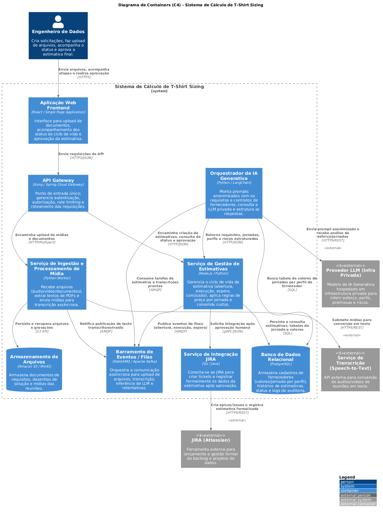
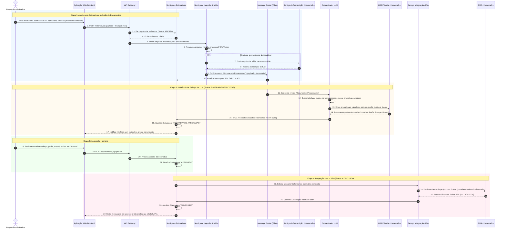

# Resposta-prompt-2

Aqui está a revisão completa do diagrama de containers e o novo diagrama de sequência no formato Mermaid, elaborados a partir da perspectiva de arquitetura de software sênior com base nas diretrizes fornecidas.

### 1. Diagrama de Containers C4 (Revisado e Ajustado em PlantUML)

O diagrama de Containers foi ajustado para explicitar o JIRA como a ferramenta de controle de projetos, além de alinhar as integrações com a LLM em infraestrutura privada:

```plantuml
@startuml
!include https://raw.githubusercontent.com/plantuml-stdlib/C4-PlantUML/master/C4_Container.puml
LAYOUT_WITH_LEGEND()
title Diagrama de Containers (C4) - Sistema de Cálculo de T-Shirt Sizing
Person(engenheiro, "Engenheiro de Dados", "Cria solicitações, faz upload de arquivos, acompanha o status e aprova a estimativa final.")
System_Boundary(tshirt_system, "Sistema de Cálculo de T-Shirt Sizing") {
    Container(web_app, "Aplicação Web Frontend", "React / Single Page Application", "Interface para upload de documentos, acompanhamento dos status do ciclo de vida e aprovação da estimativa.")
    Container(api_gateway, "API Gateway", "Kong / Spring Cloud Gateway", "Ponto de entrada único; gerencia autenticação, autorização, rate limiting e roteamento das requisições.")
    Container(estimativa_service, "Serviço de Gestão de Estimativas", "Node.js / Python", "Gerencia o ciclo de vida da estimativa (abertura, execução, espera, conclusão), aplica regras de preço por jornada e consolida custos.")
    Container(ingestao_service, "Serviço de Ingestão e Processamento de Mídia", "Python Worker", "Recebe arquivos (áudio/vídeo/documentos), extrai textos de PDFs e envia mídias para transcrição assíncrona.")
    Container(ia_orchestrator, "Orquestrador de IA Generativa", "Python / LangChain", "Monta prompts anonimizados com os requisitos e contratos de fornecedores, consulta a LLM privada e estrutura as respostas.")
    Container(jira_integration_service, "Serviço de Integração JIRA", "Go / Java", "Conecta-se ao JIRA para criar tickets e registrar formalmente os dados da estimativa após aprovação.")
    ContainerDb(database, "Banco de Dados Relacional", "PostgreSQL", "Armazena cadastros de fornecedores (valores/jornada por perfil), histórico de estimativas, status e logs de auditoria.")
    ContainerDb(file_store, "Armazenamento de Arquivos", "Amazon S3 / MinIO", "Armazena documentos de requisitos, desenhos de solução e mídias das reuniões.")
    Container(message_broker, "Barramento de Eventos / Filas", "RabbitMQ / Apache Kafka", "Orquestra a comunicação assíncrona para upload de arquivos, transcrição, inferência de LLM e retentativas.")
}
System_Ext(ext_llm, "Provedor LLM (Infra Privada)", "Modelo de IA Generativa hospedado em infraestrutura privada para inferir esforço, perfis, premissas e riscos.", "<<external>>")
System_Ext(ext_transcriber, "Serviço de Transcrição (Speech-to-Text)", "API externa para conversão de áudios/vídeos de reuniões em texto.", "<<external>>")
System_Ext(ext_jira, "JIRA (Atlassian)", "Ferramenta externa para lançamento e gestão formal do backlog e projetos de dados.", "<<external>>")
' Relacionamentos Usuário -> Sistema
Rel(engenheiro, web_app, "Envia arquivos, acompanha etapas e realiza aprovação", "HTTPS")
Rel(web_app, api_gateway, "Envia requisições de API", "HTTPS/JSON")
' Roteamento do Gateway
Rel(api_gateway, estimativa_service, "Encaminha criação de estimativas, consulta de status e aprovação", "HTTP/JSON")
Rel(api_gateway, ingestao_service, "Encaminha upload de mídias e documentos", "HTTP/Multipart")
' Relacionamentos Internos - Serviço de Estimativas
Rel(estimativa_service, database, "Persiste e consulta estimativas, tabelas de jornada e valores", "SQL")
Rel(estimativa_service, message_broker, "Publica eventos de fluxo (abertura, execução, espera)", "AMQP")
Rel(estimativa_service, jira_integration_service, "Solicita integração após aprovação humana", "gRPC/JSON")
' Relacionamentos Internos - Ingestão e Mídia
Rel(ingestao_service, file_store, "Persiste e recupera arquivos e gravações", "S3 API")
Rel(ingestao_service, ext_transcriber, "Submete mídias para conversão em texto", "HTTPS/REST", "<<external>>")
Rel(ingestao_service, message_broker, "Notifica publicação de texto transcrito/extraído", "AMQP")
' Relacionamentos Internos - IA Generativa
Rel(ia_orchestrator, message_broker, "Consome tarefas de estimativa e transcrições prontas", "AMQP")
Rel(ia_orchestrator, database, "Busca tabela de valores de jornadas por perfil de fornecedor", "SQL")
Rel(ia_orchestrator, ext_llm, "Envia prompt anonimizado e recebe análise de esforço/jornadas", "HTTPS/REST", "<<external>>")
Rel(ia_orchestrator, estimativa_service, "Retorna requisitos, jornadas, perfis e riscos estruturados", "HTTP/JSON")
' Relacionamentos Internos - Integração JIRA
Rel(jira_integration_service, ext_jira, "Cria épicos/issues e registra estimativa formalizada", "HTTPS/REST", "<<external>>")
@enduml
```



### 2. Diagrama de Sequência (Comportamental em Mermaid)

Este diagrama representa o fluxo comportamental cobrindo as 4 etapas solicitadas: Abertura da Estimativa, Inclusão de Documentos, Aprovação da Estimativa e Integração com o JIRA.


