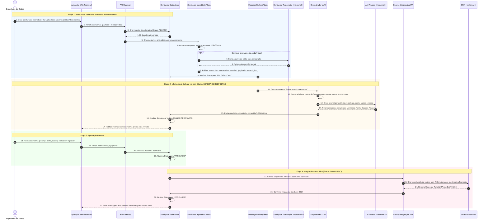

# Resposta-prompt-2

Aqui está a revisão completa do diagrama de containers e o novo diagrama de sequência no formato Mermaid, elaborados a partir da perspectiva de arquitetura de software sênior com base nas diretrizes fornecidas.

### 1. Diagrama de Containers C4 (Revisado e Ajustado em PlantUML)

O diagrama de Containers foi ajustado para explicitar o JIRA como a ferramenta de controle de projetos, além de alinhar as integrações com a LLM em infraestrutura privada:

```plantuml
@startuml
!include https://raw.githubusercontent.com/plantuml-stdlib/C4-PlantUML/master/C4_Container.puml
LAYOUT_WITH_LEGEND()
title Diagrama de Containers (C4) - Sistema de Cálculo de T-Shirt Sizing
Person(engenheiro, "Engenheiro de Dados", "Cria solicitações, faz upload de arquivos, acompanha o status e aprova a estimativa final.")
System_Boundary(tshirt_system, "Sistema de Cálculo de T-Shirt Sizing") {
    Container(web_app, "Aplicação Web Frontend", "React / Single Page Application", "Interface para upload de documentos, acompanhamento dos status do ciclo de vida e aprovação da estimativa.")
    Container(api_gateway, "API Gateway", "Kong / Spring Cloud Gateway", "Ponto de entrada único; gerencia autenticação, autorização, rate limiting e roteamento das requisições.")
    Container(estimativa_service, "Serviço de Gestão de Estimativas", "Node.js / Python", "Gerencia o ciclo de vida da estimativa (abertura, execução, espera, conclusão), aplica regras de preço por jornada e consolida custos.")
    Container(ingestao_service, "Serviço de Ingestão e Processamento de Mídia", "Python Worker", "Recebe arquivos (áudio/vídeo/documentos), extrai textos de PDFs e envia mídias para transcrição assíncrona.")
    Container(ia_orchestrator, "Orquestrador de IA Generativa", "Python / LangChain", "Monta prompts anonimizados com os requisitos e contratos de fornecedores, consulta a LLM privada e estrutura as respostas.")
    Container(jira_integration_service, "Serviço de Integração JIRA", "Go / Java", "Conecta-se ao JIRA para criar tickets e registrar formalmente os dados da estimativa após aprovação.")
    ContainerDb(database, "Banco de Dados Relacional", "PostgreSQL", "Armazena cadastros de fornecedores (valores/jornada por perfil), histórico de estimativas, status e logs de auditoria.")
    ContainerDb(file_store, "Armazenamento de Arquivos", "Amazon S3 / MinIO", "Armazena documentos de requisitos, desenhos de solução e mídias das reuniões.")
    Container(message_broker, "Barramento de Eventos / Filas", "RabbitMQ / Apache Kafka", "Orquestra a comunicação assíncrona para upload de arquivos, transcrição, inferência de LLM e retentativas.")
}
System_Ext(ext_llm, "Provedor LLM (Infra Privada)", "Modelo de IA Generativa hospedado em infraestrutura privada para inferir esforço, perfis, premissas e riscos.", "<<external>>")
System_Ext(ext_transcriber, "Serviço de Transcrição (Speech-to-Text)", "API externa para conversão de áudios/vídeos de reuniões em texto.", "<<external>>")
System_Ext(ext_jira, "JIRA (Atlassian)", "Ferramenta externa para lançamento e gestão formal do backlog e projetos de dados.", "<<external>>")
' Relacionamentos Usuário -> Sistema
Rel(engenheiro, web_app, "Envia arquivos, acompanha etapas e realiza aprovação", "HTTPS")
Rel(web_app, api_gateway, "Envia requisições de API", "HTTPS/JSON")
' Roteamento do Gateway
Rel(api_gateway, estimativa_service, "Encaminha criação de estimativas, consulta de status e aprovação", "HTTP/JSON")
Rel(api_gateway, ingestao_service, "Encaminha upload de mídias e documentos", "HTTP/Multipart")
' Relacionamentos Internos - Serviço de Estimativas
Rel(estimativa_service, database, "Persiste e consulta estimativas, tabelas de jornada e valores", "SQL")
Rel(estimativa_service, message_broker, "Publica eventos de fluxo (abertura, execução, espera)", "AMQP")
Rel(estimativa_service, jira_integration_service, "Solicita integração após aprovação humana", "gRPC/JSON")
' Relacionamentos Internos - Ingestão e Mídia
Rel(ingestao_service, file_store, "Persiste e recupera arquivos e gravações", "S3 API")
Rel(ingestao_service, ext_transcriber, "Submete mídias para conversão em texto", "HTTPS/REST", "<<external>>")
Rel(ingestao_service, message_broker, "Notifica publicação de texto transcrito/extraído", "AMQP")
' Relacionamentos Internos - IA Generativa
Rel(ia_orchestrator, message_broker, "Consome tarefas de estimativa e transcrições prontas", "AMQP")
Rel(ia_orchestrator, database, "Busca tabela de valores de jornadas por perfil de fornecedor", "SQL")
Rel(ia_orchestrator, ext_llm, "Envia prompt anonimizado e recebe análise de esforço/jornadas", "HTTPS/REST", "<<external>>")
Rel(ia_orchestrator, estimativa_service, "Retorna requisitos, jornadas, perfis e riscos estruturados", "HTTP/JSON")
' Relacionamentos Internos - Integração JIRA
Rel(jira_integration_service, ext_jira, "Cria épicos/issues e registra estimativa formalizada", "HTTPS/REST", "<<external>>")
@enduml
```


### 2. Diagrama de Sequência (Comportamental em Mermaid)

Este diagrama representa o fluxo comportamental cobrindo as 4 etapas solicitadas: Abertura da Estimativa, Inclusão de Documentos, Aprovação da Estimativa e Integração com o JIRA.



[![](https://mermaid.ink/img/pako:eNq9WFtv4kYU_isjS62IyiVcE6xVJC84WVbhInA2VcXLxB7IbOwZOrZpNlGe-rC_Y9WHlSr1sb-AP9ZzxgZsAtlK3ZSHYBuf79y_cyaPhis9ZphGyH6NmXBZl9O5osFUTQWBD40jKeLghqnNEzeSithiTmiIX0zcMq4k8RjpUk-G6_cWVEXc5QsqInLNbvBta-Fzl66-rv6Q-tG5kiJiwtsncnGtJUY9ckEj9hv9tO8lO4wmTC25y_Blfbn6qk2BX3hAI76kew3qgd1htCuUPEXrfiT91V8ep_tk3yp5xxTK9lkY0jlbPymcc5-GR_tkJo6zq8xRVISu4kk43rxh9xFTgvpnZ_sAhsq9BdsUxeAD0lBBuvDeg_vLy_4-GXiMr-LXSEEkPPpNNe-5ovsi2oM8QVkktr7vja29wvAcpfT3Pk0__EBK_-WTwbEda2SRqkmst_bYuQKFXYvYE6fXt5zeB7gkvUHn8mqy-n1IujbpDjtXfXvgDCff2xbF3Iio-U2h1jguklrjFP40m5siwI-QESNyyXTXFDNFaxI7oguq3YAOi2JFCSRpW7sEa9L14xDDjg0m3ThgItp2GX4AtXR2Bg1lkmoZBCAflNAMIMsCzugDiRe-pB6BbiUUCokv4aIQ6IoPK95GSc4LwActF9cmqZXJaDhxSGWLC-IL-kmD_kSC2I84FgaZcZ_lUS6uASQbgXqZdBSnCgI551DQ2s-MwYVJRKM4TBM9zIFtcUqpaQ3wv7vjMvQYlP4zI5JmN0mzDAFcogWbUFDB7pHKsLopWSjpYqPrmGRhEoQMVKtMLBXQByboFkxIMqlD3NcwZNQ9DysOdEc-i9lruYi0UToY0HdL7Ly_WYi3qy-xx2VlCdliOXNyJgHhmOQkdW1tDIonWU48i7IUtAsFCKWMb6dlMmZAPmJHjETgSUz9rHiG0nNGJTxpkjYUUHyDs4CwJUaVTI1taY_SQOEsMbJ1ldObK4QEeKeyqseQDjSNP1CSVFHi9tSw-8T-2e5cdazh1FgDZaz-7kRVM8loPOzYk4mlaYh86FkJMY-BrYC6CvZkZCOL2WQMl9Be1uTo9biq2USa0oR1_BJXgYlrkgIXemLG1OpPgfyiZ-xMKpwOWGLozKZXX3Iml6_sWIOMAX11pAhlwL5ZGFm4LMpzUKCrt3EItRYBJ_racjcOAQ-vwAPBXAZTFLoLugMWEt3xAXQgFVLwAKrHky9o0yGq1tetlsrqQnNXX3w39lNKS4JVJAumZjwsro1gRPHQzXMBYJaeO9LYtiBYu5BhpHlOxcjzwHmF9_ibRwF7lOqwAXkBOsdaxdELbuQ6Z82JqAfIHAJAXIquwCrmgcUuJsnnoNMpTW45MH3IH7iYHyDnHfTWwb60Lq6scdcadIew-Y2HH6xcgz6n_GTmAc0NZMRnyCccFhU1oy7aGGSnwEIlqUVFii15mKG81-z8upm6svqMu8i7q7412FlWXnkl0b3-cps_X0nQbAjZMl353sUBFfTQ0qFnA4Q0N3YLhyr-CAsoIf8Ac67VqHyat8tGtb1n26g8cu-pQlPJl9aLGgyBNW_A0YVx8Du3Hvyrkq1VD5esTm73f5ojDSDhgWNfjNNyssmlNVh9TofK-XDcty7JYJhb0V9peiTr7sFNdxO9ojZmXVfoQPYsgV2anCi206MzxNW91z247J2dZc4pkB1g-AnQkcuhwX0qVl-TXQ3JPaD-zjqYVE1-IczAIbi2t7bZTHkYxqwSUcVmenoAwEfgYW17yn9F8jHlXpLbXmdcUDhUA3xOHSgoPfMiQ--dW7qEOpXE4e4dS09WBXZvAnE4VqlaqzeODtufq9ymHqkzDpGAOS2Qw5PIQ1RcrSZbKy93wWHi3qTsm2xdw6X0nt_ArGUCT88BhjSMsUMlBM_n4o54XGGANThsmNsgZHrMKBpzxT3DhAHIikbAwEO8NR7xlakR3bKATQ0TLj2q7sAw8QQycFL9RcpgLaZkPL81zBn1Q7iLFx5MuPRfIJtXQBlTHRmLyDBhZ0IIw3w07g0TaqTRajROTo4bzfrJcbVdND4ZZum0Ua61W616q35SbR_X2_WnovGglVbL9Vq7WWvVm81q7bR6Wj15-gdjEmq_?type=png)](https://mermaid.live/edit#pako:eNq9WN1u4kYUfpWRpVZE5f8nIdYqkhecLKuAEZBNVXEzsQcyG3uGjm2aTZSrXuxzrHqxUqVe9gl4sZ4zNmATyFbqplwE2_h85_87Z_JouNJjhmmE7NeYCZd1OZ0rGkzVVBD40DiSIg5umNo8cSOpiC3mhIb4xcQt40oSj5Eu9WS4fm9BVcRdvqAiItfsBt-2Fj536err6g-pH50rKSImvH0iF9daYtgjFzRiv9FP-16yw2jM1JK7DF_Wl6uv2hT4hQc04ku616Ae2B1Gu0LJU7TuR9Jf_eVxuk_2rZJ3TKFsn4UhnbP1k8I592l4tE9mPJnsKpsoKkJX8SQcb96w-4gpQf2zs30AjnJvwTZFMfiA5ChIF957cH952d8nA4_xVfwaKoiER7-p5j1XdF9Ee5AnKIvE1ve9kbVXGJ6jlP7ep-mHH0jpv3wyOPbEGlqkZhLrrT2aXIHCrkXs8aTXtya9D3BJeoPO5dV49btDujbpOp2rvj2YOOPvbYtibkTU_KZQb1aLpN5sw59Wa1ME-BEyYkQume6aYqZoTWJHdEG1G9BhUawogSRta5dgTbp-HGLYscGkGwdMRNsuww-gls7OoKFMUiuDAOSDEpoBZFnAGX0g8cKX1CPQrYRCIfElXBQCXfFhxdsoyXkB-KDl4tok9TIZOuMJqWxxQXxBP2nQn0gQ-xHHwiAz7rM8ysU1gGQj0CiTjuJUQSDnHApa-5kxuDCOaBSHaaKdHNgWp5Sa1gT_uzsuQ49B6T8zIml2k7TKEMAlWrAJBRXsHqkMq5uShZIuNrqOSRYmQchAHZeJpQL6wATdgglJxg2I-xqGDLvnYWUC3ZHPYvZaLiJtlA4G9N0SO-9vFuLt6kvscVlZQrZYzpycSUA4JjlJXVsbg-JJlhPPoiwF7UIBQinjW7tMRgzIR-yIkQg8iamfFc9Qes6ohCdNcgoFFN_gLCBsiVElU2Nb2sM0UDhLjGxd5fTmCiEB3qmsWhXSgabxB0qSKkrcnhp2n9g_252rjuVMjTVQxurvTlR1kwxHTscejy1NQ-RDz0qIeQRsBdRVsMdDG1nMJiO4hPayxkevx1WtFtKUJqzqS1wFJq5JClzoiRlTqz8F8ouesTOpcDpgiaEzm159yZlcvrJjDTIG9NWRIpQB-2ZhZOGyKM9Bga7exiHUWgSc6GvL3TgEPLwCDwRzGUxR6C7oDlhIdMcH0IFUSMEDqB5PvqBNh6jWWLdaKqsLzV198d3YTyktCVaRLJia8bC4NoIRxUM3zwWAWXruSHPbgmDtQoaR5jkVI88D5xXe428eBexhqsMG5AXoHGkVRy-4keucNSeiHiBzCABxKboCq5gHFruYJJ-DzklpfMuB6UP-wMX8ADnvoB8f7Evr4soada1B14HNb-R8sHIN-pzyk5kHNDeQEZ8hn3BYVNSMumhjkJ0CC5WkFhUptuRhhvJes_MbZurK6jPuIu-u-tZgZ1l55ZVE9_rLbf58JUGzIWTLdOV7FwdU0ENLh54NENLc2C0cqvgjLKCE_APMuVaj8mneLhu10z3bRuWRe08Vmkq-tF7UYQiseQOOLoyD37n14F-VbL12uGR1crv_0xxpAgkPJvbFKC0nm1xag9XndKicO6O-dUkGTm5Ff6Xpkay7BzfdTfSK2ph1XaED2bMEdmlyothOj46Dq3uve3DZOzvLnFMgO8DwY6Ajl0OD-1Ssvia7GpJ7QP2ddTCpmvxCmIFDcG1vfbOZ8jCMWSWiis309ACAj8DD2vaU_4rkY8q9JLe9zrigcKgG-Jw6UFB65kWG3ju3dAl1KsmEu3csPVkV2L0JxDGxSrV6o3l02P5c5bb0SJ1xiATMaYEcnkQeouJqNdlaebkLDhP3JmXfZOs6LqX3_AZmLRN4eg4wpGGMHSoheD4Xd8TjCgOswWHD3AYh02NG0Zgr7hkmDEBWNAIGHuKt8YivTI3olgVsaphw6VF1B4aJJ5CBk-ovUgZrMSXj-a1hzqgfwl288GDCpf8C2bwCypjqyFhEhtk81RCG-WjcGyZEt1pvnrSOTxrVarNdO24XjU-GCQlqlxvwFI6DtfZp7bRZfyoaD1ptrdxstFqn1Xa9Wa9XT5rHJ0__ADeUayo)
